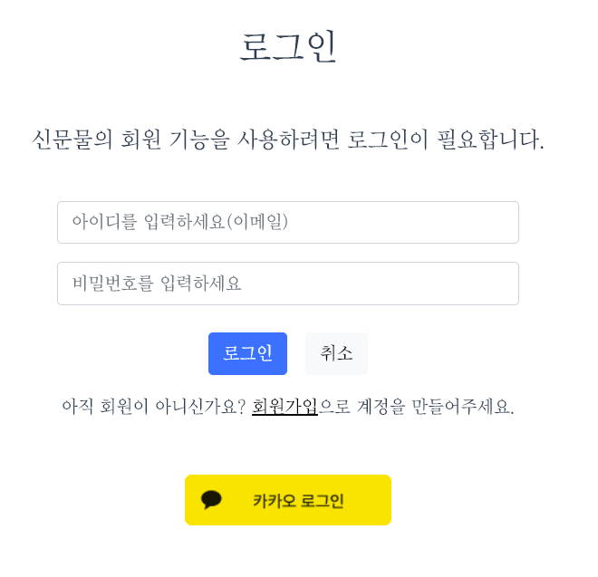

# 시연 시나리오

## 회원가입

전체 페이지 레이아웃 우상단의 "회원가입" 버튼을 눌러 회원가입을 진행한다.

회원가입에 필요한 정보를 기입한다.

이메일 인증을 필수로 진행해야만 회원가입을 진행할 수 있다.

## 로그인

레이아웃 우상단의 "로그인" 버튼을 눌러 회원가입을 진행한다.

로그인에 필요한 정보를 기입한다.

카카오 계정 연동을 이용해서 로그인을 할 수 있다.

## 메인화면 - 워드클라우드

메인 페이지에서 실시간 이슈를 나타낸 워드 클라우드를 볼 수 있다.

워드클라우드 상단의 대분류를 눌러 대분류별 이슈 키워드를 볼 수 있다.

좌측 워드클라우드에 표시된 키워드를 클릭하면 해당 키워드가 들어있는 뉴스가 우측에 3개 출력된다.

## 메인화면 - 추천기사

메인 페이지 최하단에서 로그인을 하고 관심사 토픽을 지정했을 경우 추천기사를 볼 수 있다.

선호하는 토픽에 대해 긍정값이 높은 기사 하나와 부정값이 높은 기사 하나씩을 각각 추천한다.

## 세부 검색

메인 페이지 좌상단의 검색어 창에 키워드를 입력하면 해당 키워드가 포함된 기사를 출력한다.

검색 결과 페이지에서 검색어에 관련된 키워드와 언급량 추이, 뉴스목록을 볼 수 있다.

## 마이페이지 - 선호 토픽

마이페이지에서 선호 토픽을 지정하면 선호 토픽에 대한 추천기사를 볼 수 있다.

추천받고 싶은 토픽을 선택한 뒤 하단의 변경 버튼을 눌러 변경사항을 저장할 수 있다.

## 마이페이지 - 비밀번호 변경

마이페이지에서 현재 계정의 비밀번호를 변경할 수 있다.

현재 비밀번호와 바꾸고자 하는 비밀번호를 입력한 뒤 하단의 변경 버튼을 눌러 변경사항을 저장할 수 있다.

## 마이페이지 - 스크랩 기사

마이페이지의 스크랩 기사 탭에서 스크랩한 기사들을 확인하고 삭제할 수 있다.

스크랩된 기사들을 카드 형태로 확인 가능하며, 클릭하면 해당 기사를 볼 수 있다.

또한 스크랩 기사 카드 우상단의 X버튼을 눌러 스크랩된 기사를 삭제할 수 있다.